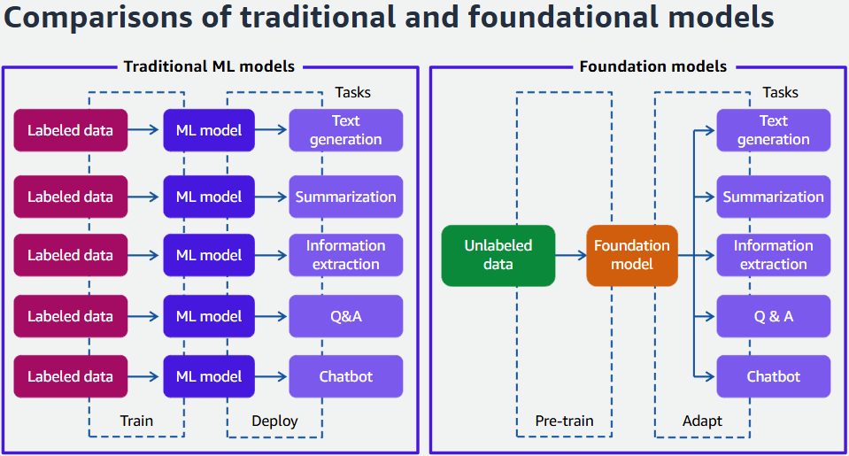

# Generative AI

## Pode gerar:

- Musica
- Imagens
- Histórias
- Conversas
- Videos

## ML Tradicional

- Modelos partem dos dados que nós damos a ele
- Cada modelo pode fazer apenas um objetivo
- Modelos precisam ser treinados com muito cuidado com os dados que provisionamos

## IA Generativa

- Modelos são pré-treinados em um monte de dados de domínio.
- Modelos podem performar vários objetivos
- Modelos podem gerar conteúdo.

## Dados de fundação

- Gerador de texo
- Organização de dados
- Extração de informações
- Perguntas e respostas
- Interações Chatbots

---

## Engenharia de Prompt

- Design e refinamento de prompts
- Modelo de linguagem em grande escala(LLM)
- Gera respostas específicas para cada pergunta

Prompt -> Fundation Model -> Output

- Text-to-Text:
  - Input e output são textos.
- Text-to-embeddings:
  - Tranforma o texto em pesquisa númerica (Por exemplo)
- Multimodal:
  - Input de texto transforma em uma imagem (Por exemplo)

---

## Pode ser usado para diversas aplicações

- Melhorar a Experiência do Usuário
  - Chatbots e assistentes virtuais
  - Assistente de agente e analise de chamadas
  - Personalização dos ADs
- Melhorar produtividade do empregado
  - Pesquisa conversacional
  - Geração de código
  - Geração de reports automáticos.
- Otimizar processos
  - Processamento de documentos inteligente
  - Geração de dados para treinar ML
  - Otimização de Supply Chain
- Aumentar a criatividade e criação de conteúdo
  - Marketing gerado por IA
  - Guias e ativação baseada em IA
  - Geração de novos produtos

---

## Está sendo usado em vários mercados diferentes

- Saúde

  - Escrivão digital do paciente.
  - Interpretação de imágens médicas
  - Medicina baseada na genética, estilo de vida, sintomas.
  - Assistente de saúde inteligente, para reports.
  - Automatização dos códigos médicos, contas e processos administrativos

- Ciências

  - Desenvolvimento de novos remédicos
  - Descobrimento de novas drogas
  - Melhorar triagem clínica simulando pacientes.
  - Report de pesquisa automatizada.
  - Triagem Otimizada baseado em inclusão e exclusão de critérios. Determinar se um paciente é elegível baseado em co-comorbidades.

- Serviços financeiros

  - Portifólios gerados por IA.
  - Aumentar o valor da empresa em projetos.
  - Inovação e automação de processos.
  - Documentação

- Manufatura
  - Design de produto
  - Eficiência operacional
  - Diagnóstico em tempo real de equipamentos
  - Rastreabilidade de Suprimentos
  - Assistentes de manutenção gerados por IA

## Problemas infrentados por empresas que trabalham com Gen IA e como a amazon contornou-os

- Flexibilidade

  - Desafio: Precisam dos melhores FMs.
  - Solução: A AWS provisiona diversas startups de IA, AI21 Labs, Anthropic e Stability AI.

- Segurança

  - Desafio: Precisam ser muito seguros.
  - Solução: Usando Amazon Bedrcok, clientes podem refinar modelos de forma particular sem precisar de muitos dados(20 é o suficiente).

- Infraestrutura

  - Desafio: Ter um bom custo-benefício
  - Solução: NVIDIA GPUs

- Construtor amigável

  - Desafio: Precisam de um lugar para fazer deploy das FMs
  - Solução: Usando Amazon S3 e SageMaker

- Serviços AWS
  - Desafio: Procurar por soluções.
  - Solução: Amazon Q Developer

## Serviços AWS

- Amazon Bedrock
  - É altamente configuravel para manter suas FMs disponíveis via API.
- Amazon Q Developer
  - Funciona dentro da sua IDE.
- AWS Inferentia
  - Usa Deep Learning para melhorar a performance sem aumentar os custos.
- AWS Trainium
  - 
- Amazon SageMaker JumpStart
  - 
