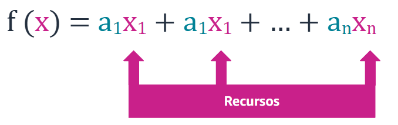
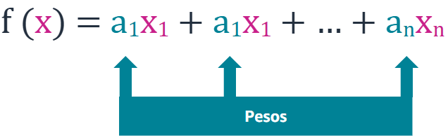
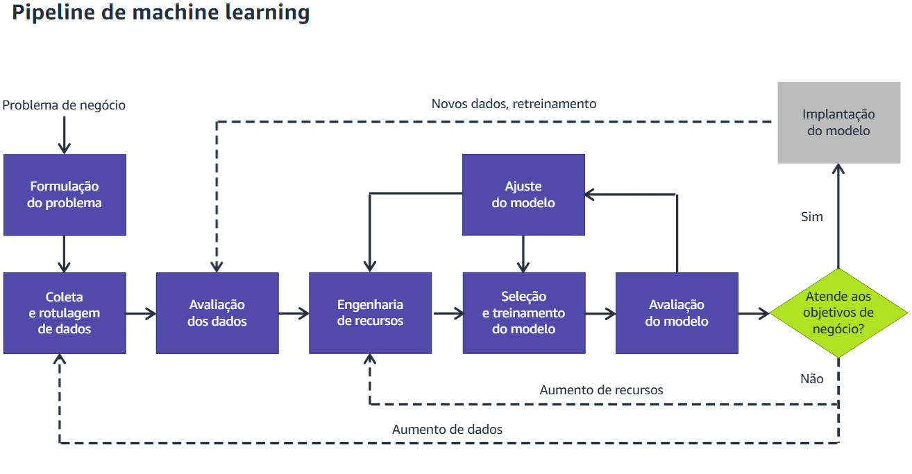

# Meu dia 01 no curso Machine Learning pela AWS Educate

## Inteligência artficial

> É um termo amplo para a inteligência demonstrada pelas máquinas. Programas de inteligência artificial tentam entender e replicar a inteligência humana e aprender com os resultados.

> Exemplo:

- Máquinas que conseguem aprender xadrez com base em regras.

## Machine Learning

> É um subgrupo da inteligência artifical no qual um programa de computador deriva regras a partir dos próprios dados. Ele usa uma variedade de dados coletados no passado para encontrar padrões escondidos. Os padrões são em seguida utilizados para criar um modelo, que sera aplicado a novos dados para fornecer uma previsão bem mais informada e adaptável.

> Exemplo:

- Máquinas que aprendem a jogar xadrez a partir de partidas quie foram jogadas anteriormente.
- Dados -> Modelo -> Previsão

## Deep Learning

> É um subgrupo de machine learning em que o programa de computador tem um aprendizado dinâmico, ajustando ações com base em feedbacks contínuos para maximizar uma recompensa.

> Exemplo:

- Máquinas que jogam xadrez utilizando feedback contínuo em tempo real para reagir na partida em andamento.

---

## Terminologias

- `Modelo`
  - Um modelo de ML é o algoritimo treinado que é utilizado para `identificar padrões` nos seus dados. Um modelo é treinado a partir do processo de ML, e ele captura e armazena padrões. `Quanto mais padrões um modelo armazenar, maior ele será.` O tamanho de modelos de ML é geralmente descirto em megabytes. `O propósito de um modelo é prever os resultados de novas entradas de dados com base em padrões observados previamente.`
- `Algoritimo de treinamento`
  - Tratando-se de machine learning, você pode utilizar algoritmos de treinamento como ajuda para realizar tarefas empíricas que demandam algum tipo de inferência indutiva. Esse objetivo envolve indução porque utiliza dados para treinar algoritimos para fazer inferências generalizáveis. Assim, os algoritmos podem fazer previsões ou decisões estatisticamente confiáveis, ou concluir outras tarefas, quando aplicarem novos dados que não foram utilizados para treiná-los. Um algoritmo treinado por algoritimos identifica padrões em seus dados sem que sejam necessárias regras explícitas definidas manualmente.
- `Visão computacional`
  - Coma a visão computacional, as máquinas podem identificar pessoas, lugares e coisas em imagens com precisão de nível humano ou até superior com mais velocidade e eficiência. Frequentemente construída com modelos de deep learning, ela automatiza a extração, análise, classificação e entendimento de informações úteis a partir de uma única imagem ou sequências de imagens. Os dados de imagens podem aparecer de várias formas, como por imagens individuais, sequências de vídeos, registros de várias câmeras ou dados tridimensionais.
- `Redes Neurais Artificiais`
  - Uma rede neural artificial é uma coleção de unidades ou nós conectados que são utilizados para criar um modelo de informação baseado em sistemas biológicos. Cada nó é considerado um neurônio artificial e imita um neurônio biológico. Ele recebe uma entrada (Estímulo), é ativado se o sinal de entrada for forte o suficiente (Ativação) e produz uma saída baseada na entrada e na ativação. Essa rede é amplamente utilizada em machine learning porque uma rede neural artificial pode servir como uma aproximação de uso geral para qualquer função.

---

# Tipos de problemas de classificação e regressão

## Classificações Binárias `</>`

Determinam uma variável como pertencente a uma classe ou a outra. Por Exemplo, uma variável é limitada a uma de duas opções: Verdadeira ou falsa. O objetivo é prever valores que podem estar em um de dois estados.

> Exemplo:

- Fraudulento ou não.

## Classificação multiclasse

Problemas de classificação multiclasse classificam uma observação dentro de uma entre três ou mais categorias. O propósito é reduzir o número de transferencias necessárias para fazer com que o cliente chege ao departamento correto de atendimento ao cliente.

> Exemplo:

- Contabilidade ou Suporte de TI ou Retornos

## Regressão

Prever um valor numérico.

> Exemplo:

- Preço de uma ação vai subir 20 dolares até amanhã.

---

# Tipos de aprendizado

## Supervisionado

Usa entradas e saídas conhecidas para generalizar saídas futuras. O aprendizado supervisionado é um tipo popular de ML porque é amplamente aplicável. `Ele é chamado de supervisionado porque deve haver os dados de treinamento que são rotulados.`

> Exemplo:

- O modelo `recebe imagens de carros que pessoas rotularam como carros`. Depois quando o modelo receber uma nova imagem de um carro que não é rotulada, ele pode prever que é um carro.

## Não-Supervisionado

O modelo `não conhece entradas ou saídas`, então, ele encontra padrões nos dados sem ajuda. Uma subcategoria de aprendizado não supervisionado é o agrupamento em `clusters`. Esse tipo de algoritimos agrupa dados em diferentes clusters com base em recursos similares para entender melhos os atributos de um cluster específico.

> Exemplo:

- Por exemplo, ao analisar os hábitos de compra de clientes, um `algoritimo de aprendizado não supervisionado pode identificar se a empresa é grande ou pequena.`

## Por reforço

Diferentemente dos dois primeiros algoritmos, ele `melhora o modelo continuamente ao minerar feedback de iterações anteriores.` No aprendizado por reforço, um agende aprende continuamente, por tentativa e erro, à medida que interage em um ambiente. É muito útil quando se conhece o prêmio por um resultado desejado, mas não se sabe como obtê-lo. Ou seja, o caminho para obter o resultado não é conhecido, e, para descobri-lo, são necerrárias muitas tentativas e erros.

> Exemplo:

- No simulador AWS DeepRacer, o agente é o carro virtual, e o ambiente é uma pista de corrida virtual. As ações são comandos de aceleração. O objetivo é concluir a corrida o mais rápido possível sem se desviar da pista.

---

# Recursos e pesos.

## Recursos

São as partes dos seus conjuntos de dados que são identificadas como importantes para determinar resultados precisos. Por exemplo, o primeiro recurso pode ser se um item é ou não um chapéu. Esses recursos devem ser empresados matematicamente; então, nesse caso o modelo irá converter um 'sim' em 1 e um 'não' em 0.

## Pesos

Pesos representam o quanto um recursos associado é importante para determinar a precisão do resultado. Portanto, algo com maior probabilidade de precisão tem peso maior, e algo com menor probabilidade de precisão tem peso menor.

# Machine Learning Pipeline

1. Formulação do problema
   - Antes de tentar resolver, precisamos ter um problema que é resolvivel com machine learning e formular esse problema.
     > Perguntas essenciais a serem feitas:
   - Como essa tarefa é feita hoje?
   - Como a empresa medirá o sucesso?
   - Como a solução será usada?
   - Existem soluções semelhantes, com as quais você poderia aprender?
   - Qual tipo de abordagem usaremos?
2. Coleta e rotulagem de dados
   - Depois que o problema está totalmente desenvolvido, precisamos fazer mais algumas perguntas. Quais dados precisamos para treinar o modelo para alcançar o resultado, temos acesso a esses dados? Se sim, quantos dados temos e onde eles estão?
   - Existem 3 tipos de dados:
   1. Dados privados
   2. Dados comerciais
   3. Dados open source
3. Avaliação dos dados
   - Avaliar os dados, muitas vezes eles chegam através de várias fontes diferentes com padrões diferentes, precisamos contactar especialistas para padronizar esses dados.
4. Engenharia de recursos
   - `Extração de recursos`: Abrange muitas atividades, que variam desde o tratamento de dados ausentes até a conversão de dados de texto em dados numéricos. Você pode combinar dados, extraí-los em várias colunas ou até removê-los completamente.
   - `Seleção de recursos`:Após extrair os recursos, precisamos selecionar os mais apropriados para treinar o modelo. Três métodos de seleção de recursos principais estão disponíveis: `Filtro, Wrapper e incorporado.`
   - `Métodos de filtro` Utilizam métodos estísticos para medir a relevância dos recursos por sua correlação com a variável de destino.
   - `Métodos wrapper` Medem a utilidade de um subconjunto de recursos treinando um modelo com ele e medindo o sucesso do modelo.
   - `Métodos incorporados` são específicos ao algoritmo e poderiam usar uma combinação de ambos.
   - Limpeza dos dados é essêncial nesse momento.
5. Seleção e treinamento do modelo
   - `Sobreajuste(Overfit)`: Ele tem um bom desempenho sobre os dados, mas não se sai bem sobre os dados de avaliação. É quando o modelo descobre as particularidades de um conjunto de dados bem demais. Isso significa basicamente memorizar os dados de treinamento em vez de realmente descobrir as relações entre recursos e rótulos. É importante que o modelo aprenda as relações e os rótulos de modo que possa aplicar o que aprende em novos dados no futuro.
   - `Subajuste`: Tem um desempenho ruim sobre os dados. O modelo não consegue captar a relação entre os exemplos de entrada (X) e os valores de destino(Y). Essa incapacidade causa o subajuste.
   - `Balanceado`:Compreender o ajuste do modelo é importante para encontrar a causa raiz de uma precisão ruim do modelo. Esse conceito orienta você a tomar medidas corretivas para determinar se um modelo preditivo está subajustando ou sobreajustando os dados de treinamento. Essas medidas envolvem examinar o erro de previsão nos dados de treinamento e nos dados de avaliação.
6. Avaliação do modelo
   - Durante a avaliação você testa seu modelo contra dados de validação reservados. Os dados de validação oferecem uma avaliação imparcial de um ajusta de modelo enquanto o modelo é ajustado. Os dados de teste possuem valores conhecidos e permitem que você avalie a exatidão do modelo após o ajuste. Se o modelo tiver um bom desempenho sobre os dados de teste, ele provavelmente terá um bom desempenho sobre os dados novos com valores de destino desconhecidos. É por isso que é importante reservar dados de teste suficientes e não usar esses dados para treinamento ou validação.
   - `A divisão normal é de 80% para treinamento, 10% para validação e 10% para teste.`
7. ## Atende aos objetivos do negócio?
8. ## Implantação do modelo
9. ## Repita tudo novamente

---

# Três camadas de stack de machine learning

## A camada de dados:

É onde os dados que alimentarão diretamente o seu modelo de ML estão armazenados

## A camada do modelo

Contém o modelo e os algoritmos que criam projeções baseados nos dados que o modelo coleta .

## A camada de implantação e monitoramento:

Esta é a camada na qual o modelo trabalha em um ambiente real e produz tarefas de ML

## Produtos AWS para Machine Learning

- Instâncias C5 e C5n do Amazon EC2
- Instâncias P3 do Amazon EC2
- AWS IoT Greengrass
- Amazon Elastic Inference
- `Visão computacional`
  - Amazon Rekognition, reconhecimento facial e de objetos para imagens e vídeos.
  - Amazon Textract, extrair texto do reconhecimento de imagens.
- `Bots de conversa`
  - Amazon Lex é um serviço que ajuda a criar apps de conversa interativa que utilizam voz e texto.
- `Fala`
  - Amazon Polly converte entradas de texto em fala
  - Amazon Transcribe converte áudio falado em texto.
- `Previsão`
  - Amazon Forecast utiliza machine learning para combinar dados de séries temporais com variáveis adicionais para criar previsões.
- `Linguagem`
  - Amazon Comprehend utiliza processamento de linguagem natural(NPM) para encontrar informações e relações no texto.
  - Amazon translate pode traduzir textos para idiomas diferentes.
- `Recomendações`
  - Amazon Personalize é outro serviço de ML que pode ajudar a criar recomendações personalizadas individuais para os clientes.

## Amazon SageMaker

O Sagemaker ajuda os cientistas e desenvolvedores de dados a preparar, construir, treinar e implantar modelos de ML de alta qualidade. Ele também fornece a capacidade para que os desenvolvedores possam iterar o processo até que acertem o modelo. O serviço reúne rapidamente um amplo conjunto de recursos para ML com um único serviço abrangente.
