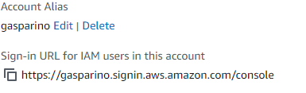

## IAM Dashboard

Da para criar alias para login.
https://gasparino.signin.aws.amazon.com/console

## Grupos e Usuários

É bom criar grupos para reutilizar policies

Podemos dar attach de policies com mais de 400 policies prontas

É uma boa prática deixar tanto full access quanto read only, porque se acontecer algo é só retirar o full access

Para criar usuário é igual criar grupos, dentro do dashboard.
nomes de usuario é bom ser formal

Programmatic Acess - ( Conta de serviço )
Chave publica e privada.

> Usado para APIs em AWS

Tags é sempre bom utilizar para gerenciar custos de forma mais fácil

Podemos criar policies para maquinas especificas

ARN: Amazon Resource Name
Para gerenciar policies específicas

## Roles e Policies

Policies == CRUD
O que os usuarios podem fazer

Roles
O que os serviços podem fazer
