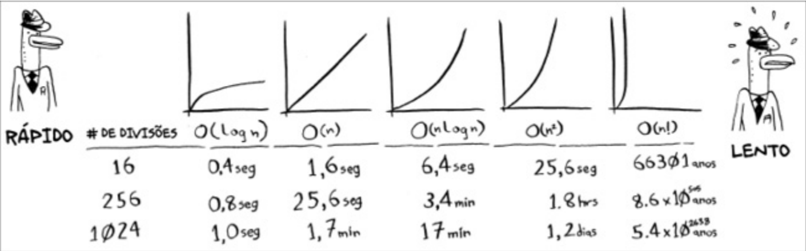

# Algoritimos crescem em taxas diferentes.
- A notação Big O informa o quão rápido é um algoritmo. Por exemplo, imagine que você tem uma lista de tamanho n. O tempo de execução na notação Big O é O(n). Onde estão os segundos? Eles não existem – a notação Big O não fornece o tempo em segundos. A notação Big O permite que você compare o número de operações. Ela informa o quão rapidamente um algoritmo cresce.

O O(n) o n sempre será na pior das hipóteses

```plaintext
• O(log n), também conhecido como tempo logarítmico. Exemplo: pesquisa
binária.
• O(n), conhecido como tempo linear. Exemplo: pesquisa simples. • O(n * log n). Exemplo: um algoritmo rápido de ordenação, como a ordenação quicksort (explicada no Capítulo 4).
• O(n 2 ). Exemplo: um algoritmo lento de ordenação, como a ordenação por seleção (explicada no Capítulo 2).
• O(n!). Exemplo: um algoritmo bastante lento, como o do caixeiro-viajante
```

