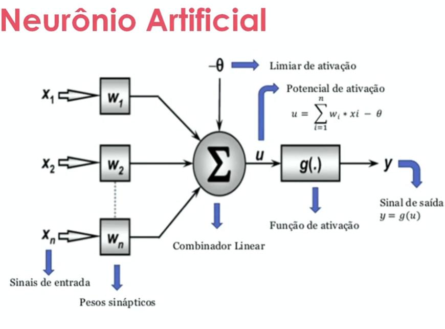

# Algoritimos bioinspirados

- Aprendizado de máquina é inspirado em diversos casos biológicos
- Os das formigas, abelhas, redes neurais do cérebro, Genética.
- Fuzzy - Diferentes pontos de vista

> Respostas deterministicas - Resposta Exata

> Repostas Heuristicas - Testando e aprendendo

## Redes Neurais
- Rede neural artificial (RNA
)